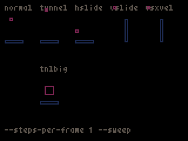

# platformer

## platformer: physics

Gravity and collision detection for a 2d platformer + test bed.

Reusable.

## platformer: prototype

2d platformer prototype where the player can move back and forth between "worlds" (2d layers).

Implemented using the Entity Component System pattern.

Features a double-jump implementation.

